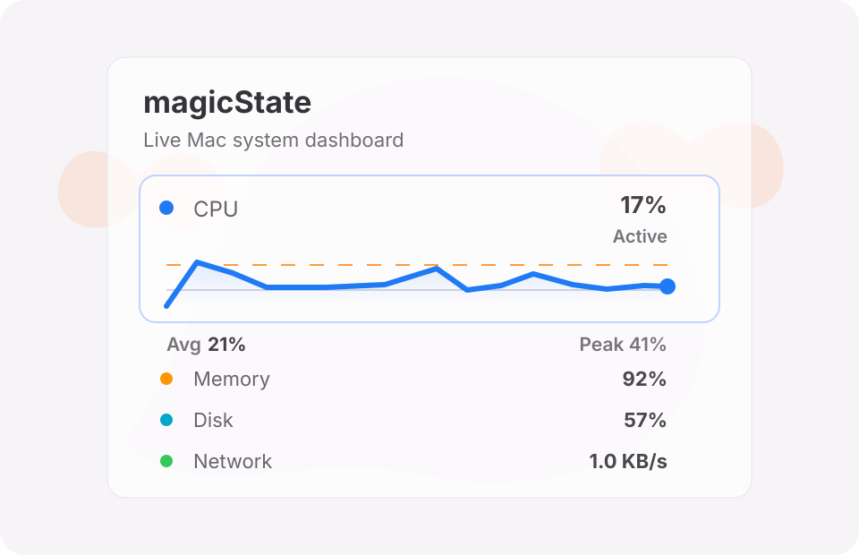

# magicState

magicState 是一个 macOS 菜单栏系统监控小工具，用来快速查看 CPU、内存、磁盘、网络、电池和公开 thermal state。它是纯菜单栏工具，启动后不会显示 Dock 图标，所有入口都在菜单栏。



## 功能

- 菜单栏实时显示 `CPU xx%  RAM yy%`
- 点击菜单栏项查看紧凑系统状态面板
- CPU 趋势图显示本次运行期间最多 30 分钟历史
- 支持查看内存、磁盘、网络、电池和 Sensors 摘要
- 可从菜单栏面板打开完整 Dashboard
- 不采集、不上传、不保存个人数据

## 系统要求

- macOS 15.6 或更高版本
- Apple Silicon 或 Intel Mac

## 下载和安装

1. 打开 GitHub 的 [Releases](https://github.com/Izumi-iii/magicState/releases) 页面。
2. 下载最新版本里的 `magicState-vX.Y.Z-macos.zip`。
3. 解压后把 `magicState.app` 拖到 `Applications` 文件夹。
4. 打开 `magicState.app`，菜单栏会出现 `CPU xx%  RAM yy%`。

### 首次打开提示

当前学习版没有做 Apple Developer ID 签名和 notarization。macOS 可能会提示“无法验证开发者”。

如果出现这个提示，可以这样打开：

1. 在 Finder 中找到 `magicState.app`。
2. 右键点击 App，选择 `打开`。
3. 在弹窗里再次选择 `打开`。

这只需要在首次运行时操作一次。后续如果做正式签名和公证，就可以减少或避免这个提示。

## 从源码运行

```sh
swift test
xcodebuild -project magicState.xcodeproj -scheme magicState -destination 'platform=macOS' build
```

也可以直接用 Xcode 打开 `magicState.xcodeproj`，选择 `magicState` scheme 后运行。

## 打包 Release

本地生成 GitHub Release 用的 zip：

```sh
./scripts/package-release.sh
```

脚本会读取 Xcode 项目里的版本号，并输出：

```text
dist/magicState-vX.Y.Z-macos.zip
```

也可以手动指定版本号：

```sh
./scripts/package-release.sh 1.0.0
```

发布到 GitHub 的建议流程：

```sh
swift test
./scripts/package-release.sh 1.0.0
git tag v1.0.0
git push origin v1.0.0
```

然后在 GitHub Releases 页面创建 `v1.0.0` Release，上传 `dist/magicState-v1.0.0-macos.zip`。

## 隐私说明

magicState 只读取 macOS 公开或本机可用的系统状态信息，用于本地展示。当前版本不会联网发送监控数据，也不会把历史数据写入磁盘。CPU 历史只保留在本次 App 运行期间，退出后会清空。

## 已知限制

- Sensors 目前保持公开 API 做法，只展示 macOS 公开 thermal state，不读取私有 SMC 温度数据。
- 未签名下载版首次运行可能触发 macOS 安全提示。
- Homebrew Cask 和 Developer ID notarization 还没有配置。
